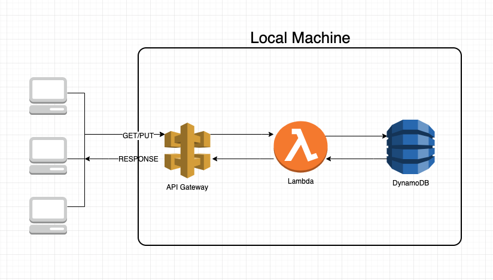

# sam-dynamodb-local
A hands-on tutorial on using SAM with DynamoDB Local.

## Develop and test your serverless applications locally with DynamoDB local.

This repository contains an AWS Lambda function that puts and gets a Person record (First name, Last name, Age) to/from a local DynamoDB instance. The process flow is as follows:  

  

### Development Environment Prerequisites
- [Install AWS CLI](https://docs.aws.amazon.com/cli/latest/userguide/cli-chap-install.html) and [configure](https://docs.aws.amazon.com/cli/latest/userguide/cli-chap-configure.html) the credentials.
- [Docker](https://runnable.com/docker/getting-started/) installed 
- [SAM CLI](https://docs.aws.amazon.com/serverless-application-model/latest/developerguide/serverless-sam-cli-install.html)
- Python [3.6/3.7](https://www.python.org/downloads/) with [boto3](https://boto3.amazonaws.com/v1/documentation/api/latest/guide/quickstart.html) package
- An AWS Account with permissions to IAM, CloudFormation, S3, Lambda, and DynamoDB (to deploy and test in a AWS region).  

### Steps to deploy this application
Please note:   
a. I will be using the us-east-1 region (Virginia) for deploying this application, but you may deploy to any region where Lambda and DynamoDB are available.  
b. User-specified input parameters will be marked with curly braces in the following instructions. For e.g., {s3-bucket-name} will need to be replaced with a bucket name of your choice, such as mybucketname etc.  

#### Steps
1. Clone this repo and change to the directory 'sam-dynamodb-local'.  
  
2. Start DynamoDB Local by executing the following at the command prompt:  
	*docker run -p 8000:8000 amazon/dynamodb-local*  
    This will run the DynamoDB local in a docker container at port 8000.  

3. At the command prompt, list the tables on DynamoDB Local by executing:  
    *aws dynamodb list-tables --endpoint-url http://localhost:8000*  

4. An output such as the one shown below confirms that the DynamoDB local instance has been installed and running:  
    *{*  
      *"TableNames": []*   
    *}*    

5. At the command prompt, create the PersonTable by executing:  
    *aws dynamodb create-table --cli-input-json file://json/create-person-table.json --endpoint-url http://localhost:8000*  
      
      **Note:** If you misconfigured your table and need to delete it, you may do so by executing the following command:  
        *aws dynamodb delete-table --table-name PersonTable --endpoint-url http://localhost:8000*  

6. At the command prompt, start the local API Gateway instance by executing:  
    *sam local start-api --env-vars json/env.json*  

### Testing the application
1. Insert a Person item in the table by executing the following CURL command at the prompt:  
   *curl -d '{"FName": "Henry", "LName": "McKenna", "Age": 10}' http://127.0.0.1:3000/*  

    This should output the partition key(GUID) of the item inserted into the local DynamoDB instance, such as:  
    *12a72031-8b5c-4c76-8c90-83f3d5132088*  

2. Let's retrieve the item from the local DynamoDB instance by executing the following CURL command at the prompt:  
    *curl -X GET -d ‘{“Id”:”12a72031-8b5c-4c76-8c90-83f3d5132088”}’  http://127.0.0.1:3000*  

    This will display the output as follows:  
    *Henry McKenna 10*  
     
**Note:** You may alternatively use a GUI to view the items on the local DynamoDB instance, such as the [DynamoDB Local Shell](http://localhost:8000/shell/) or [DynamoDB Manager](https://github.com/YoyaTeam/dynamodb-manager).   

### Deploying the application
1. Create a S3 bucket for storing SAM deployment artifacts in the us-east-1 region (or a region of your choosing). Please note that you may not use '-' or '.' in your bucket name.  
	*aws s3 mb s3://{s3-bucket-name} --region us-east-1*  
      
2. Create the Serverless Application Model package using CLI.  
	*aws cloudformation package \  
	--region us-east-1 \  
	--template-file template.yml \  
	--s3-bucket {s3-bucket-name} \  
	--output-template-file packaged.yml*  
      
2. Deploy the packaged template. Enter input parameters for the S3 bucket name (given in step 3 above), DynamoDB table name, and SQS queue name (from step 2 above). This step will create a DynamoDB table, and a S3 bucket using the names specified. It will also create a Lambda function with the name 'SQSLambda'.  
	*aws cloudformation deploy \  
	--region us-east-1 \  
	--template-file packaged.yml \  
	--stack-name {stack_name} \  
	--capabilities CAPABILITY_IAM*  
  
3. After the stack has been successfully created, you may test the application using the CURL commands as shown above.  

